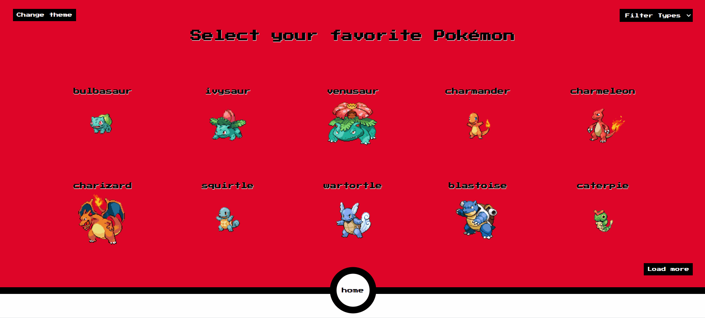
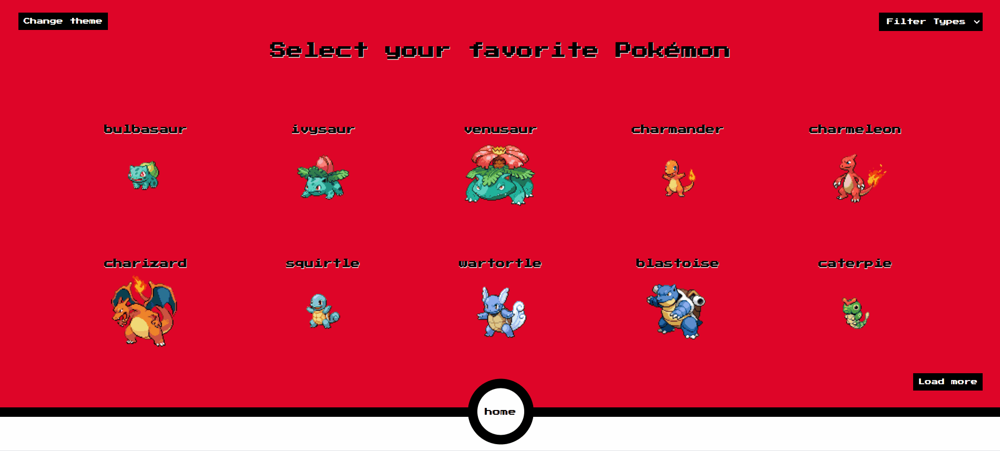

# Pokedéx

Esse projeto é feito para você poder ecolher o seu Pokémon favorito e ver suas informações detalhadas.

Na página inicial podemos selecionar um Pokémon, e ao clicar nele é possível ver suas informações (habilidades, movimentos e seus tipos). Também foi criado um filtro que possibilita filtrar o tipo de Pokémon desejado, além de ter um botão para alterar o tema do site.


<br/><br/>

<br/><br/>


## Tecnologias utilizadas
- Vite
- Javascript
- React
- Context API
- Single Page Application (SPA)
- react-router-dom

<br/>

Essas Tecnologias foram usadas para dar uma velocidade maior de processamento ao site, proporcionar um visual de interface mais agradável ao usuário e ser compatível com a simplicidade do projeto.

## Dificuldades

Minha maior dificuldade foi trabalhar com o "useState( )" do projeto, devido a não conseguir setar um estado mantendo o estado incial vazio. E outra dificuldade foi lidar com muiltiplas promisses ao mesmo tempo.

Para resolver o problema do "useState( )", fiz vários testes com o "console.log( )" para ver o que estava acontecendo com o meu estado inicial, até que consegui entender e resolver. E em relação as promisses, é necessário usar "await Promisse.all( )" para poder fazer um map no link das APIs de cada pokemon e pegar suas informações individualmente.

## Como Utilizar

1 - Crie uma pasta para armazenar o projeto, e dentro dela clone o projeto usando o comando abaixo no git Bash:
```
git clone "url do repositório"
```
2 - Após isso, abra o terminal dentro do VScode e digite o código abaixo para instalar as dependências do projeto:
```
npm install
```
3 - Pronto, já pode codar a vontade 😁👍
